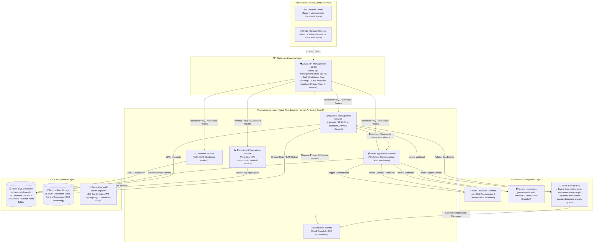
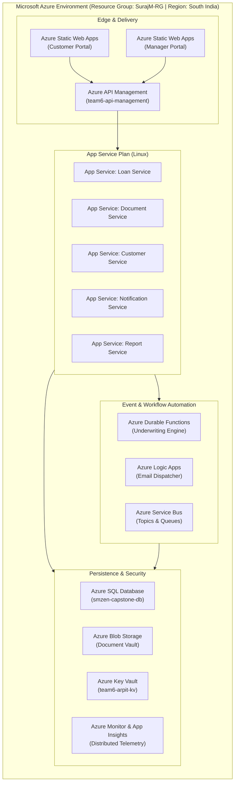
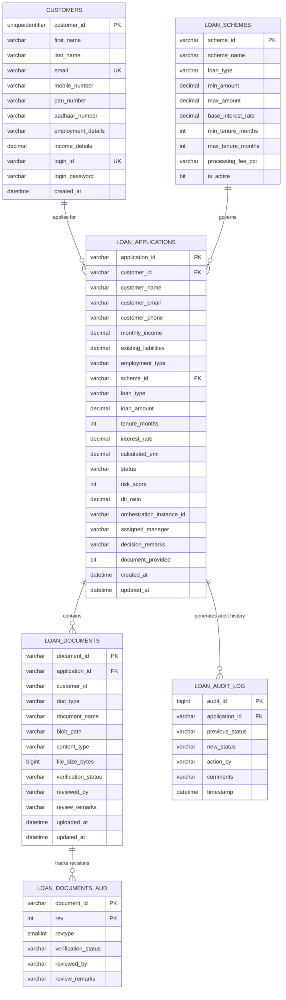
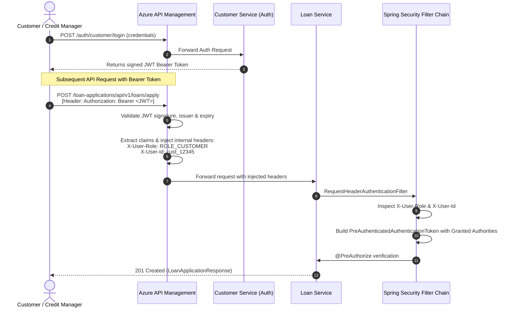
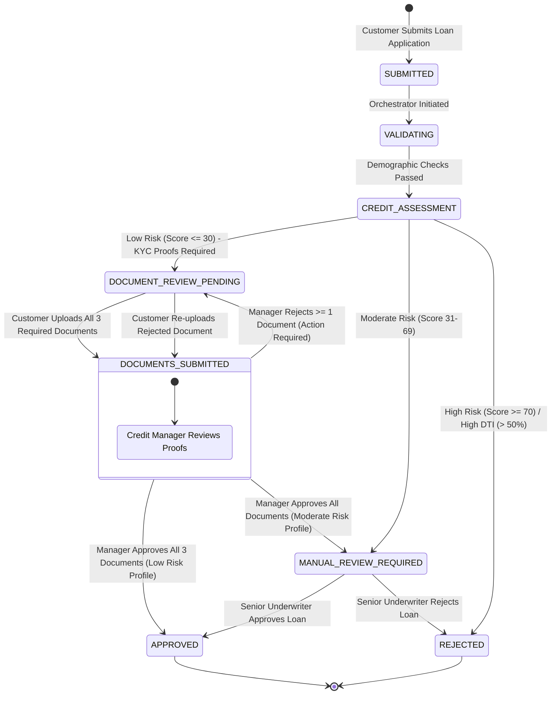
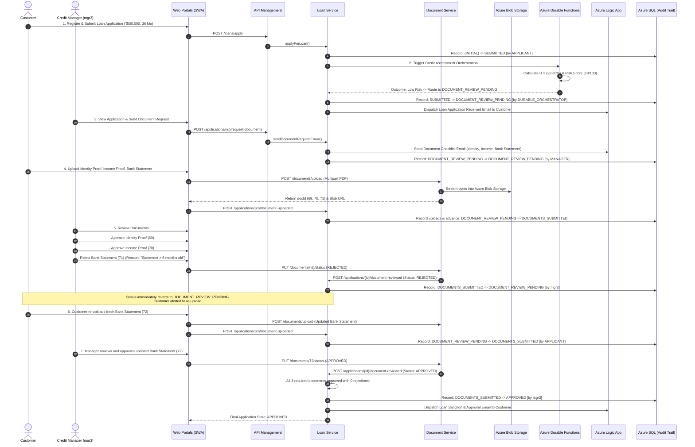

# Digital Lending & Customer Onboarding Platform
## Architecture & Technical Design Document (HLD & LLD)

---

## 1. Executive Summary

The **Azure-Powered Digital Lending & Customer Onboarding Platform** is an enterprise-grade, cloud-native banking solution built to modernize legacy retail lending operations. It replaces manual, paper-intensive loan underwriting with an automated, event-driven, microservices-based platform hosted entirely on **Microsoft Azure**.

### Key Business & Technical Highlights
- **End-to-End Digital Customer Journey**: Instant self-registration, KYC ingestion, product selection, EMI simulation, multi-document proof uploads, and real-time application lifecycle tracking.
- **Automated Credit Engine & Stateful Orchestration**: Powered by **Azure Durable Functions** to perform real-time Debt-to-Income (DTI) computation, multi-factor risk scoring, and rule-based workflow routing.
- **Strict Document Verification & Rejection Lifecycle**: Robust document workflow where individual proofs (Identity, Income, Bank Statements) are audited, verified, or rejected by Credit Managers. Rejections automatically revert application states (`DOCUMENT_REVIEW_PENDING`) and trigger customer re-upload notifications.
- **Comprehensive Immutable Audit Trail**: Full state history captured via **Hibernate Envers** and dedicated audit tables, tracking timestamps, state deltas, actor IDs, and underwriting remarks.
- **Zero-Trust Security**: Centralized API Gateway (**Azure API Management**) enforcing JWT authentication, rate limiting, and role-based header injection (`ROLE_CUSTOMER`, `ROLE_MANAGER`).

---

## 2. High Level Design (HLD)

### 2.1 High-Level Architecture Diagram

---

### 2.2 Microservices Domain Decomposition

| Service Name | Responsibility | Tech Stack | Azure Host |
| :--- | :--- | :--- | :--- |
| **Customer Service** | Customer identity, registration, password hashing (BCrypt), JWT token issuance, customer profile lookup. | Java 17, Spring Boot 3, Spring Security | Azure App Service (`team6-customer-service`) |
| **Loan Application Service** | Core lending engine: scheme catalog, EMI calculation, state transition machine, manager assignment, audit trail recording. | Java 17, Spring Boot 3, Hibernate Envers | Azure App Service (`team6-loan-service`) |
| **Document Service** | Document metadata, Azure Blob integration, secure upload/download streaming, verification status updates. | Java 17, Spring Boot 3, Azure Storage SDK | Azure App Service (`team6-document-service`) |
| **Notification Service** | Real-time Server-Sent Events (SSE) notification stream, manager alert feeds, customer notification history. | Java 17, Spring Boot 3, Spring WebFlux | Azure App Service (`team6-notification-service`) |
| **Reporting Service** | Operations dashboard, executive metrics, loan approval ratios, average turnaround time (TAT), underwriting KPIs. | Java 17, Spring Boot 3, JPA Projections | Azure App Service (`team6-report-service`) |

---

## 3. Azure Cloud Components Architecture

The architecture leverages managed Platform-as-a-Service (PaaS) and Serverless components on Microsoft Azure:

### Detailed Azure Service Inventory

| Azure Service | Resource Name / SKU | Purpose in System |
| :--- | :--- | :--- |
| **Azure API Management** | `team6-api-management` (Developer SKU) | Gateway entrypoint for all frontend traffic; enforces subscription keys, validates JWTs, injects `X-User-Role` / `X-User-Id` headers. |
| **Azure Static Web Apps** | `victorious-grass-0e6891400` (Customer) `lively-grass-0d6cbb800` (Manager) | Hosts high-performance single-page React applications with global CDN distribution and SSL termination. |
| **Azure App Service** | Linux App Service Plan (South India) | Hosts containerized Spring Boot microservices with auto-scaling and health check monitoring. |
| **Azure SQL Database** | `smzen-capstone-db` on `smzen-capstone.database.windows.net` | Enterprise relational storage with Transparent Data Encryption (TDE), automated backups, and Envers audit tables. |
| **Azure Blob Storage** | Azure Storage Account (Standard LRS) | Encrypted object storage for identity proofs, income proofs, and bank statements with SAS URL generation. |
| **Azure Service Bus** | Standard Tier Service Bus Namespace | Decoupled asynchronous messaging for loan status changes (`loan-status-topic`) and document processing events (`document-events-topic`). |
| **Azure Durable Functions** | Flex/Consumption Plan Function App | Stateful workflow orchestrator executing multi-step underwriting and credit risk calculations. |
| **Azure Logic Apps** | Consumption Logic App Workflow | Event-driven email dispatch engine sending dynamic HTML checklists and manager notifications via Office 365 / SMTP. |
| **Azure Key Vault** | `team6-arpit-kv` | Centralized hardware security module storing DB passwords, JWT secret keys, and Service Bus connection strings. |
| **Azure Monitor / App Insights** | Shared Log Analytics Workspace | Real-time metrics, HTTP dependency tracking, live transaction search, and distributed tracing. |

---

## 4. Low Level Design (LLD)

### 4.1 Database Schema & Data Models

---

### 4.2 REST API Interface Specifications

#### 1. Customer Authentication & Profile
- `POST /customers/api/customers/auth/register` — Self-service customer onboarding.
- `POST /customers/api/customers/auth/login` — Issues JWT Bearer token with claims (`userId`, `role=ROLE_CUSTOMER`).
- `POST /auth/internal/login` — Issues internal staff token (`role=ROLE_MANAGER`).

#### 2. Loan Management (`loan-service`)
- `GET /loan-applications/api/v1/loans/schemes` — Active loan schemes and interest rates.
- `POST /loan-applications/api/v1/loans/calculate-emi` — Serverless EMI calculation and amortization schedule.
- `POST /loan-applications/api/v1/loans/apply` — Application submission triggering the Durable Function Orchestrator.
- `GET /loan-applications/api/v1/loans/applications/{id}` — Full application details with customer, scheme, and document state.
- `GET /loan-applications/api/v1/loans/applications/{id}/status` — Lightweight status tracking for customer timeline.
- `GET /loan-applications/api/v1/loans/applications/{id}/audit-logs` — Complete chronological audit trail.
- `POST /loan-applications/api/v1/loans/applications/{id}/request-documents` — Manager requests required document checklist.
- `POST /loan-applications/api/v1/loans/applications/{id}/document-uploaded` — Customer notifies upload completion.
- `POST /loan-applications/api/v1/loans/applications/{id}/document-reviewed` — Review decision (`APPROVED` / `REJECTED`).
- `POST /loan-applications/api/v1/loans/applications/{id}/decision` — Final Underwriter decision (`APPROVED` / `REJECTED`).

#### 3. Document Management (`document-service`)
- `POST /documents/api/v1/documents/upload` — Multipart document upload to Azure Blob Storage.
- `GET /documents/api/v1/documents/customer/{customerId}` — Retrieve customer's uploaded document catalog.
- `GET /documents/api/v1/documents/{id}/download` — Stream document blob securely via SAS URL.
- `PUT /documents/api/v1/documents/{id}/status` — Manager verifies/rejects document; triggers event bus & loan-service callback.
- `DELETE /documents/api/v1/documents/{id}` — Removes document blob and deletes metadata.

---

### 4.3 Security & Zero-Trust Authentication Architecture

---

## 5. End-to-End Loan Processing Business Logic & State Machine

### 5.1 Loan State Machine Lifecycle

---

### 5.2 Step-by-Step Business Logic Workflow

---

## 6. Live Production Deployment & Resource Directory

| Resource Type | Endpoint / Portal URL | Status |
| :--- | :--- | :--- |
| **Customer Web Portal** | `https://victorious-grass-0e6891400.5.azurestaticapps.net` | Live & Operational |
| **Credit Manager Console** | `https://lively-grass-0d6cbb800.7.azurestaticapps.net` | Live & Operational |
| **API Management Gateway** | `https://team6-api-management.azure-api.net` | Live & Operational |
| **Loan Application Service** | `https://team6-loan-service.azurewebsites.net` | Live (`RuntimeSuccessful`) |
| **Document Management Service** | `https://team6-document-service.azurewebsites.net` | Live (`RuntimeSuccessful`) |
| **Customer Auth Service** | `https://team6-customer-service.azurewebsites.net` | Live (`RuntimeSuccessful`) |
| **Notification Service** | `https://team6-notification-service.azurewebsites.net` | Live (`RuntimeSuccessful`) |
| **Reporting & KPI Service** | `https://team6-report-service.azurewebsites.net` | Live (`RuntimeSuccessful`) |
| **Azure SQL Database** | `smzen-capstone.database.windows.net` (`smzen-capstone-db`) | Active (Envers Enabled) |
| **Azure Key Vault** | `team6-arpit-kv.vault.azure.net` | Active (Access Policies Configured) |

---

## 7. Demo Walkthrough Script for Architecture Review

### Step-by-Step Live Demo Runbook

1. **Step 1: Customer Self-Registration & Login**
   - Open Customer Portal & register new user (`cust_<timestamp>@e2etest.com`).
   - Customer is instantly authenticated and redirected to the lending dashboard.
2. **Step 2: Loan Scheme Selection & Application Submission**
   - Select Business Loan (`SCHEME-BL-01`) for ₹500,000, 36 months tenure.
   - Click **Submit Loan Application**.
   - **Show Evaluators**: Application instantly created with status `DOCUMENT_REVIEW_PENDING` (Low Risk Score 28/100, DTI 28.65%) and assigned to Credit Manager.
3. **Step 3: Manager Views Application & Sends Document Checklist**
   - Log in to Credit Manager Console (`mgr3`).
   - Open the new application and click **Send Document Request Email**.
   - Show the dispatched checklist email containing mandatory KYC, Income, and Bank Statement requirements.
4. **Step 4: Customer Uploads 3 Required Documents**
   - Switch to Customer Portal -> Document Upload section.
   - Upload:
     1. Identity Proof (`id_proof.pdf`)
     2. Income Proof (`income_proof.pdf`)
     3. Bank Statement (`bank_statement.pdf`)
   - Notice application status automatically advances from `DOCUMENT_REVIEW_PENDING` $\to$ `DOCUMENTS_SUBMITTED`.
5. **Step 5: Manager Audits Documents — Approve 2 & Reject 1**
   - Manager reviews Identity Proof $\to$ **Approve**.
   - Manager reviews Income Proof $\to$ **Approve**.
   - Manager reviews Bank Statement $\to$ **Reject** with remark: *"Bank statement is over 6 months old. Please submit a recent statement."*
   - **Highlight to Evaluators**: Loan application status immediately goes back to `DOCUMENT_REVIEW_PENDING` and audit log captures the rejection reason.
6. **Step 6: Customer Re-uploads Fresh Bank Statement**
   - Customer sees rejection notice in their dashboard and uploads the updated bank statement.
   - Application status transitions back to `DOCUMENTS_SUBMITTED`.
7. **Step 7: Manager Approves Final Document $\to$ Loan Sanction**
   - Manager opens updated bank statement $\to$ clicks **Approve**.
   - System detects all 3 documents verified with 0 rejections $\to$ application moves to **`APPROVED`**!
8. **Step 8: Review Complete Audit Trail**
   - Open Audit Trail tab in Manager Console or via API.
   - Point out every state delta, timestamp, changed-by actor, and underwriting remark.
