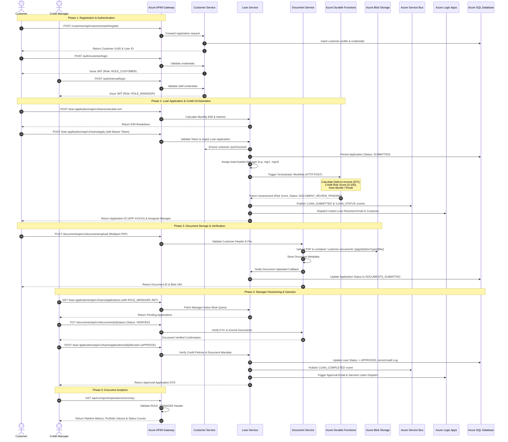
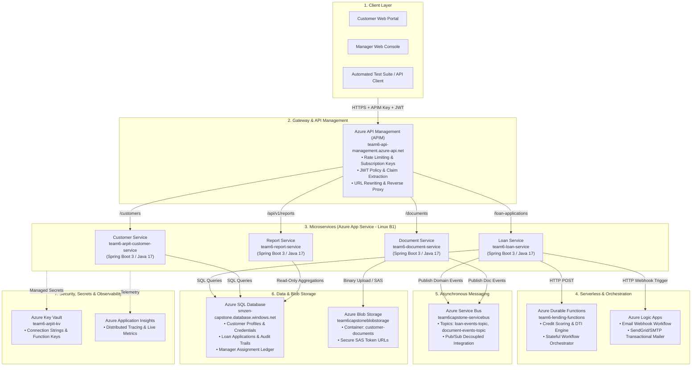

# 🏦 Digital Lending & Banking Platform: Architecture, Workflow & Azure Services Guide

## 1. Executive System Overview

The **Digital Lending & Banking Platform** is an enterprise-grade cloud-native lending solution hosted on **Microsoft Azure**. It automates the end-to-end loan application lifecycle—from initial customer onboarding and loan eligibility calculation, through automated credit scoring and document verification, to manager underwriting decisioning and multi-channel notifications.

The system enforces strict **Role-Based Access Control (RBAC)**, isolating customer activities from internal underwriting manager operations via an **Azure API Management (APIM)** gateway security layer.

---

## 2. Complete End-to-End Workflow



---

## 3. Detailed Step-by-Step Workflow Breakdown

### Step 1: Customer Onboarding & Security Verification
- **Customer Registration**: New applicants register via `/customers/api/customers/auth/register`, creating both login credentials and a customer record.
- **JWT Authentication & RBAC**:
  - Customers authenticate at `/auth/customer/login` receiving a JWT with `ROLE_CUSTOMER`.
  - Internal credit managers authenticate at `/auth/internal/login` receiving a JWT with `ROLE_MANAGER`.
- **APIM Gateway Gatekeeper**:
  - Validates `Ocp-Apim-Subscription-Key`.
  - Decodes and extracts claims into `X-User-Id`, `X-User-Role`, and `X-Customer-Id`.
  - Strictly blocks unauthorized attempts (e.g. customers accessing manager executive analytics receive `HTTP 401/403`).

### Step 2: Product Catalog & EMI Computation
- Customers query active loan products (`/loan-applications/api/v1/loans/schemes`) to view interest rates, loan limits, and tenures.
- The financial EMI calculator computes exact monthly repayments, total interest, and total payable amount using standard banking amortization formulas.

### Step 3: Loan Application Submission & Manager Allocation
- The applicant submits their monthly income, existing debt liabilities, loan amount, and tenure.
- The system automatically assigns the application to the least-loaded Credit Manager from the managers pool (`mgr1` Arjun Rao, `mgr2` Meera Iyer, `mgr3` Karan Malhotra, `mgr4` Divya Nair, `mgr5` Mark Johnson) to balance workload.
- An initial audit trail record is generated.

### Step 4: Credit Assessment via Azure Durable Functions
- The loan service invokes an Azure Durable Function Orchestrator.
- The function calculates the **Debt-to-Income (DTI)** ratio and computes a **Credit Risk Score (0–100)**:
  - **Score $\le$ 30 (Low Risk)**: Auto-approved upon document verification.
  - **Score 31–69 (Medium Risk)**: Routed to Senior Underwriter for manual underwriting.
  - **Score $\ge$ 70 (High Risk)**: Automated rejection.
- Transitions state to `DOCUMENT_REVIEW_PENDING`.

### Step 5: Document Upload & Azure Blob Storage
- Applicant uploads mandatory KYC and income verification documents (e.g. Identity Proof, Salary Slips, Bank Statements) via `multipart/form-data`.
- The **Document Service** streams the binary files directly to **Azure Blob Storage** in the `customer-documents` container under organized hierarchical paths (`{applicationId}/{docType}/{fileName}`).
- Once all mandatory documents are submitted, the application advances to `DOCUMENTS_SUBMITTED`.

### Step 6: Manager Underwriting & Credit Policy Validation
- Credit Managers access their queue (`GET /loan-applications/api/v1/loans/applications`).
- Managers review documents and update verification status (`PUT /documents/api/v1/documents/{id}/status` $\rightarrow$ `VERIFIED`).
- **Credit Rule Enforcement**: Managers submit a loan decision (`APPROVE` or `REJECT`). If mandatory verification documents are missing or unverified, the system blocks sanctioning with `HTTP 409 Conflict`.
- Upon successful approval, the status changes to `APPROVED`.

### Step 7: Event Publishing via Azure Service Bus
- The application publishes asynchronous domain events (`loan-events-topic` and `document-events-topic`):
  - `LOAN_SUBMITTED`
  - `LOAN_DOCUMENT_REVIEW_PENDING`
  - `LOAN_DOCUMENTS_SUBMITTED`
  - `LOAN_APPROVED` / `LOAN_REJECTED`

### Step 8: Multi-Channel Alerts & Azure Logic Apps
- **In-App Real-Time Alerts**: Real-time notifications queued for managers when new cases are assigned or documents are submitted.
- **Transactional Emails**: Dispatched via **Azure Logic Apps** HTTP trigger webhook sending automated emails with application IDs, status updates, and sanction letters.

### Step 9: Executive Reports & Analytics
- The **Report Service** aggregates portfolio health, monthly disbursement volumes, average ticket sizes, and application status distribution for executive dashboards.

---

## 4. Azure Cloud Services Architecture



---

## 5. Summary of Azure Services Utilized

| Azure Service | Resource Name / Configuration | Purpose in Digital Lending Platform |
|---|---|---|
| **Azure API Management (APIM)** | `team6-api-management` | Single entry-point API gateway, enforces subscription key (`Ocp-Apim-Subscription-Key`), validates JWT tokens, extracts claims into custom headers (`X-User-Role`, `X-User-Id`), enforces RBAC, and routes requests to backend microservices. |
| **Azure App Service (Linux B1)** | • `team6-loan-service`<br>• `team6-document-service`<br>• `team6-report-service`<br>• `team6-arpit-customer-service` | Hosts the core Spring Boot 3 Java 17 microservices on scalable Linux containers with automated health probes and managed ports. |
| **Azure Durable Functions** | `team6-lending-functions` | Serverless stateful orchestrator executing complex financial business logic: calculates Debt-to-Income (DTI) ratio, computes risk scores (0–100), and auto-routes applications based on underwriting thresholds. |
| **Azure Service Bus** | `team6capstone-servicebus` | Enterprise publish/subscribe message broker with topics (`loan-events-topic`, `document-events-topic`) enabling asynchronous event-driven integration between lending services. |
| **Azure Blob Storage** | `team6capstoneblobstorage` (Container: `customer-documents`) | Cloud object storage for customer KYC documents (passports, national IDs, salary slips, bank statements) with support for direct binary streaming and time-limited secure Shared Access Signature (SAS) tokens. |
| **Azure SQL Database** | `smzen-capstone.database.windows.net` (`smzen-capstone-db`) | High-availability relational database storing customer profiles, loan applications, status audit trails, and manager assignment ledgers. |
| **Azure Logic Apps** | Webhook Workflow (`prod-00.southeastasia.logic.azure.com`) | Serverless workflow engine triggered via HTTP webhooks to send automated transactional HTML emails (welcome emails, loan submission acknowledgments, approval/rejection notices). |
| **Azure Key Vault** | `team6-arpit-kv` | Secure hardware-backed secret storage managing database connection strings, Service Bus shared access keys, and storage account access credentials. |
| **Azure Application Insights** | Application Insights Instance (`b6469689-...`) | Centralized observability platform providing distributed tracing, live application metrics, error telemetry, and latency diagnostics. |

---

## 6. Security & Role Mapping Matrix

| Role Name | Permitted Actions | Restricted Endpoints |
|---|---|---|
| **`ROLE_CUSTOMER`** | • Register & Authenticate<br>• Calculate EMIs<br>• Submit Loan Applications<br>• Track Personal Application Status<br>• Upload KYC/Income Documents<br>• View Personal Documents via SAS URLs | Blocked from all Manager Queues (`/loan-applications/applications`), Document Verification (`PUT /documents/{id}/status`), and Executive Reports (`/api/v1/reports/*`). |
| **`ROLE_MANAGER`** | • View Global & Assigned Application Queues<br>• Review & Verify Uploaded Documents (`VERIFIED` / `REJECTED`)<br>• Sanction / Reject Loan Applications (`APPROVE` / `REJECT`)<br>• View Full Audit Logs & Decision Timelines<br>• Access Operational Summaries & Monthly Executive Trends | Cannot submit customer loan applications on behalf of unauthorized identities without valid customer records. |
| **Unauthenticated / No Key** | Access schemes catalog (`/loans/schemes`), document types (`/documents/types`), health check (`/ping`). | Blocked with `HTTP 401 Access Denied` by APIM Gateway if subscription key is missing. |

---

## 7. How to Execute the End-to-End Test Suite

To validate all workflows and Azure service integrations locally or in CI/CD pipelines:

```powershell
powershell.exe -ExecutionPolicy Bypass -File ".\test_suite.ps1"
```

The test script automatically:
1. Queries the master product catalogs via APIM.
2. Registers and authenticates a test customer and internal manager.
3. Performs RBAC negative security testing.
4. Executes the financial EMI calculator.
5. Submits a new loan application triggering the Durable Function orchestrator.
6. Queries real-time audit logs and manager queues.
7. Dispatches transactional notifications via Azure Logic Apps.
8. Outputs the consolidated execution scorecard.
