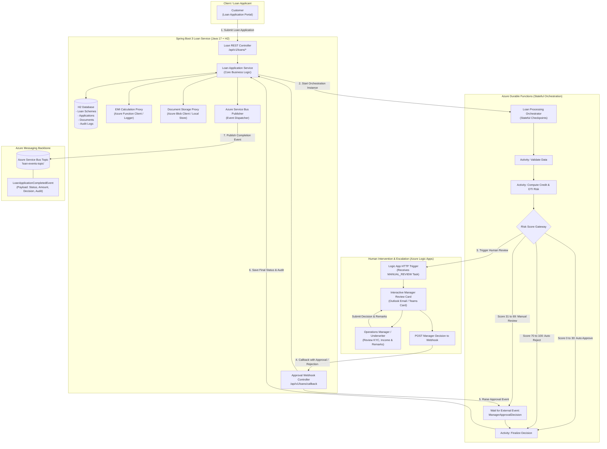
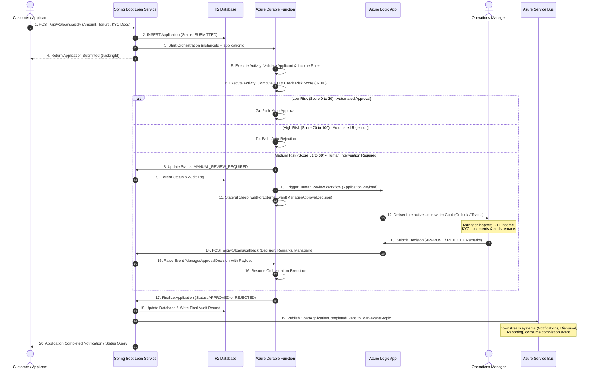

# Loan Service: Stateful Orchestration, Human Intervention & Azure Event Bus

Focused technical design and execution plan strictly for the **Loan Service** built with **Java 17**, **Spring Boot 3.x**, **H2 Database**, **Azure Durable Functions (Stateful Orchestration)**, **Azure Logic Apps (Human Review & Approval)**, and **Azure Service Bus (Completion Event Publishing)**.

---

## 1. Executive Summary & Architecture Strategy

### 1.1 Focused Scope
The architecture is strictly focused on the **Loan Service** microservice. It provides end-to-end processing for retail loan applications (Personal, Home, Vehicle, Education loans), complete with stateful orchestration, human underwriting escalation, and downstream event publication to Azure Service Bus / Event Bus:

1. **Spring Boot 3.x (Java 17) + H2 Database**: Core REST API, loan scheme catalog, application state machine, document linking, and audit logging with an interactive H2 console.
2. **EMI Calculation & Document Storage Proxies**: Transparent clients that invoke Azure Functions (for EMI) and Azure Blob Storage (for KYC docs) with mock logger fallbacks during local testing.
3. **Stateful Orchestration $\rightarrow$ Azure Durable Functions**: Executes sequential activities: *Applicant Validation $\rightarrow$ DTI & Credit Risk Scoring $\rightarrow$ Decision Gateway*.
4. **Human Intervention Workflow $\rightarrow$ Azure Logic Apps**: For borderline applications (Risk Score $31 - 69$), the orchestrator triggers an Azure Logic App to send an interactive approval card to an Operations Manager. The manager inspects KYC documents, enters remarks, and submits an approval/rejection decision that resumes the orchestrator via a callback webhook.
5. **Completion Event Publishing $\rightarrow$ Azure Service Bus / Event Bus**: When an application reaches a terminal state (`APPROVED` or `REJECTED`), the service publishes a `LoanApplicationCompletedEvent` to the Azure Service Bus topic `loan-events-topic` for downstream consumers (e.g., Notification Service, Disbursal Engine).

---

## 2. Loan Service Architecture & Workflow Diagram



---

## 3. Loan Service End-to-End Sequence & Flow Diagram



---

## 4. Human Intervention & Escalation Details

### 4.1 Trigger Condition
An application transitions to `MANUAL_REVIEW_REQUIRED` when:
- **Risk Score is between 31 and 69** (borderline credit profile).
- **Debt-to-Income (DTI) ratio is between 40% and 55%**.
- **High loan amounts** exceeding standard automated limits ($> \$500,000$).

### 4.2 Operations Manager Review Details
The interactive card presented to the manager contains:
1. **Applicant Profile**: Name, monthly income, existing debt obligations, employment type.
2. **Loan Request**: Scheme selected, requested amount, tenure, calculated EMI.
3. **Automated Risk Assessment**: Calculated DTI ratio, computed risk score, specific rule triggers.
4. **Uploaded Documents**: Direct links to view KYC identity, income proof, and bank statements.
5. **Action Bar**:
   - `[APPROVE]` with optional discount or interest rate adjustment.
   - `[REJECT]` with mandatory reason classification.
   - `[REQUEST_DOCUMENTS]` to notify the applicant of missing proofs.
   - `Mandatory Remarks Text Area`: Underwriting justification recorded directly into the audit log.

---

## 5. Azure Service Bus Completion Events

Upon reaching a terminal state (`APPROVED` or `REJECTED`), the Loan Service publishes a standardized event to Azure Service Bus topic `loan-events-topic`.

### 5.1 Event Schema (`LoanApplicationCompletedEvent`)
```json
{
  "eventId": "evt-9a8b7c6d-5e4f",
  "eventType": "LOAN_APPLICATION_COMPLETED",
  "timestamp": "2026-08-20T14:30:00Z",
  "data": {
    "applicationId": "APP-2026-8801",
    "customerId": "CUST-1049",
    "customerName": "John Doe",
    "customerEmail": "john.doe@example.com",
    "loanType": "HOME_LOAN",
    "loanAmount": 450000.00,
    "tenureMonths": 180,
    "interestRate": 8.25,
    "calculatedEMI": 4367.89,
    "finalStatus": "APPROVED",
    "riskScore": 42,
    "reviewedBy": "manager.sarah@bank.com",
    "decisionRemarks": "Approved after verifying supplementary income tax returns.",
    "completedAt": "2026-08-20T14:30:00Z"
  }
}
```

### 5.2 Dual-Mode Event Publisher
- **Local Dev Mode (`azure.enabled: false`)**:
  Logs the event to console:
  ```
  [MOCK AZURE SERVICE BUS] ======================================================
  [MOCK AZURE SERVICE BUS] Topic: 'loan-events-topic' | Event: 'LOAN_APPLICATION_COMPLETED'
  [MOCK AZURE SERVICE BUS] Application APP-2026-8801 -> Final Status: APPROVED
  [MOCK AZURE SERVICE BUS] Evaluated By: manager.sarah@bank.com | Risk Score: 42
  [MOCK AZURE SERVICE BUS] Remarks: Approved after verifying supplementary income tax returns.
  [MOCK AZURE SERVICE BUS] ======================================================
  ```
- **Azure Cloud Mode (`azure.enabled: true`)**:
  Uses `com.azure:azure-messaging-servicebus` to publish directly to the Azure Service Bus Topic.

---

## 6. H2 Database Schema (DDL)

```sql
-- 1. LOAN SCHEMES
CREATE TABLE LOAN_SCHEMES (
    SCHEME_ID VARCHAR(36) PRIMARY KEY,
    LOAN_TYPE VARCHAR(30) NOT NULL,          -- PERSONAL, HOME, VEHICLE, EDUCATION
    SCHEME_NAME VARCHAR(100) NOT NULL,
    MIN_AMOUNT DECIMAL(18, 2) NOT NULL,
    MAX_AMOUNT DECIMAL(18, 2) NOT NULL,
    MIN_TENURE_MONTHS INT NOT NULL,
    MAX_TENURE_MONTHS INT NOT NULL,
    BASE_INTEREST_RATE DECIMAL(5, 2) NOT NULL,
    IS_ACTIVE BOOLEAN DEFAULT TRUE
);

-- 2. LOAN APPLICATIONS
CREATE TABLE LOAN_APPLICATIONS (
    APPLICATION_ID VARCHAR(36) PRIMARY KEY,
    CUSTOMER_ID VARCHAR(36) NOT NULL,
    CUSTOMER_NAME VARCHAR(100) NOT NULL,
    CUSTOMER_EMAIL VARCHAR(100) NOT NULL,
    CUSTOMER_PHONE VARCHAR(20) NOT NULL,
    MONTHLY_INCOME DECIMAL(18, 2) NOT NULL,
    EXISTING_LIABILITIES DECIMAL(18, 2) DEFAULT 0.00,
    EMPLOYMENT_TYPE VARCHAR(50) NOT NULL,    -- SALARIED, SELF_EMPLOYED
    SCHEME_ID VARCHAR(36) NOT NULL,
    LOAN_TYPE VARCHAR(30) NOT NULL,
    LOAN_AMOUNT DECIMAL(18, 2) NOT NULL,
    TENURE_MONTHS INT NOT NULL,
    INTEREST_RATE DECIMAL(5, 2) NOT NULL,
    CALCULATED_EMI DECIMAL(18, 2) NOT NULL,
    STATUS VARCHAR(30) NOT NULL,              -- SUBMITTED, VALIDATING, CREDIT_ASSESSMENT, MANUAL_REVIEW_REQUIRED, APPROVED, REJECTED
    RISK_SCORE INT,
    DTI_RATIO DECIMAL(5, 2),
    ORCHESTRATION_INSTANCE_ID VARCHAR(100),
    ASSIGNED_MANAGER VARCHAR(100),
    DECISION_REMARKS VARCHAR(1000),
    CREATED_AT TIMESTAMP DEFAULT CURRENT_TIMESTAMP,
    UPDATED_AT TIMESTAMP DEFAULT CURRENT_TIMESTAMP,
    CONSTRAINT FK_SCHEME FOREIGN KEY (SCHEME_ID) REFERENCES LOAN_SCHEMES(SCHEME_ID)
);

-- 3. LOAN DOCUMENTS
CREATE TABLE LOAN_DOCUMENTS (
    DOCUMENT_ID VARCHAR(36) PRIMARY KEY,
    APPLICATION_ID VARCHAR(36),
    CUSTOMER_ID VARCHAR(36) NOT NULL,
    DOC_TYPE VARCHAR(50) NOT NULL,            -- IDENTITY_PROOF, INCOME_PROOF, ADDRESS_PROOF, BANK_STATEMENT
    FILE_NAME VARCHAR(255) NOT NULL,
    CONTENT_TYPE VARCHAR(100) NOT NULL,
    BLOB_STORAGE_PATH VARCHAR(500) NOT NULL,
    FILE_SIZE_BYTES BIGINT NOT NULL,
    UPLOADED_AT TIMESTAMP DEFAULT CURRENT_TIMESTAMP
);

-- 4. APPLICATION AUDIT LOGS
CREATE TABLE LOAN_AUDIT_LOGS (
    LOG_ID BIGINT AUTO_INCREMENT PRIMARY KEY,
    APPLICATION_ID VARCHAR(36) NOT NULL,
    PREVIOUS_STATUS VARCHAR(30),
    NEW_STATUS VARCHAR(30) NOT NULL,
    CHANGED_BY VARCHAR(100) NOT NULL,        -- SYSTEM, DURABLE_FUNCTION, LOGIC_APP_MANAGER
    COMMENTS VARCHAR(1000),
    TIMESTAMP TIMESTAMP DEFAULT CURRENT_TIMESTAMP,
    CONSTRAINT FK_AUDIT_APP FOREIGN KEY (APPLICATION_ID) REFERENCES LOAN_APPLICATIONS(APPLICATION_ID)
);
```

---

## 7. REST API Specifications (Loan Service)

| Method | Endpoint | Description |
| :--- | :--- | :--- |
| `GET` | `/api/v1/loans/schemes` | Fetch active loan schemes (Personal, Home, Auto, Education) |
| `POST` | `/api/v1/loans/calculate-emi` | Invoke EMI Azure Function (with mock logger fallback) |
| `POST` | `/api/v1/loans/documents/upload` | Ingest supporting documents (Blob storage proxy / local mock) |
| `POST` | `/api/v1/loans/apply` | Submit loan application & launch Durable Function orchestrator |
| `GET` | `/api/v1/loans/applications/{id}` | Get complete application record, risk scoring, & audit history |
| `GET` | `/api/v1/loans/applications/{id}/status` | Lightweight progress query for customer tracking UI |
| `POST` | `/api/v1/loans/applications/{id}/manager-callback` | Webhook for Logic App manager approval card responses |
| `GET` | `/api/v1/loans/applications` | Query applications with status filter (`MANUAL_REVIEW_REQUIRED`, `APPROVED`, etc.) |

---

## 8. Project Directory Structure

```
loan-service/
├── pom.xml                                     # Java 17, Spring Boot 3, Azure SDKs
├── IMPLEMENTATION_PLAN.md                      # This technical implementation blueprint
├── TESTING.md                                  # API testing and validation guide
├── src/
│   ├── main/
│   │   ├── java/com/bank/digital/lending/
│   │   │   ├── DigitalLendingApplication.java  # Spring Boot Main Entry Point
│   │   │   ├── controller/
│   │   │   │   ├── LoanSchemeController.java
│   │   │   │   ├── LoanApplicationController.java
│   │   │   │   ├── DocumentStorageController.java
│   │   │   │   └── WebhookApprovalController.java
│   │   │   ├── model/
│   │   │   │   ├── entity/                     # LoanApplication, LoanScheme, LoanDocument, LoanAuditLog
│   │   │   │   ├── dto/                        # Request/Response DTOs, EMICalculationDTO, DecisionDTO
│   │   │   │   ├── event/                      # LoanApplicationCompletedEvent
│   │   │   │   └── enums/                      # LoanStatus, LoanType, DocType, EmploymentType
│   │   │   ├── repository/
│   │   │   │   ├── LoanApplicationRepository.java
│   │   │   │   ├── LoanSchemeRepository.java
│   │   │   │   ├── LoanDocumentRepository.java
│   │   │   │   └── LoanAuditLogRepository.java
│   │   │   ├── service/
│   │   │   │   ├── LoanApplicationService.java
│   │   │   │   ├── LoanSchemeService.java
│   │   │   │   ├── DocumentStorageProxyService.java # Azure Blob Client / Local Store
│   │   │   │   ├── EMICalculatorProxyService.java   # Azure Function Client / Fallback
│   │   │   │   ├── CreditRiskScoringService.java
│   │   │   │   └── AzureEventBusPublisherService.java # Service Bus Event Publisher
│   │   │   ├── orchestration/
│   │   │   │   ├── LoanDurableOrchestrator.java    # Durable Function & Stateful Engine
│   │   │   │   └── LogicAppApprovalConnector.java   # Logic App Human Review Client
│   │   │   └── config/
│   │   │       ├── H2DataInitializer.java          # Seeds default schemes and demo records
│   │   │       ├── OpenApiConfig.java              # Swagger UI docs configuration
│   │   │       └── GlobalExceptionHandler.java     # Clean JSON error responses
│   │   └── resources/
│   │       ├── application.yml                     # H2 and Azure integration flags
│   │       ├── schema.sql                          # H2 DDL
│   │       └── data.sql                            # Initial Scheme Catalog
│   └── test/
│       └── java/com/bank/digital/lending/
│           ├── LoanApplicationServiceTest.java
│           ├── HumanInterventionApprovalTest.java  # Validates manual review & webhook flow
│           └── AzureEventBusPublisherTest.java     # Validates completion event emission
```

---

## 9. Verification & Execution Plan

### Automated Test Cases
1. **Automated Approval Flow (Risk Score $\le 30$)**:
   - Submits application $\rightarrow$ Orchestrator auto-approves $\rightarrow$ H2 state is `APPROVED` $\rightarrow$ Verifies `LoanApplicationCompletedEvent` published to Service Bus.
2. **Automated Rejection Flow (Risk Score $\ge 70$)**:
   - Submits application $\rightarrow$ Orchestrator auto-rejects $\rightarrow$ H2 state is `REJECTED` $\rightarrow$ Verifies rejection event emitted.
3. **Human Intervention & Approval Flow (Risk Score $31 - 69$)**:
   - Submits application $\rightarrow$ State transitions to `MANUAL_REVIEW_REQUIRED`.
   - Triggers Logic App client $\rightarrow$ Simulates manager submitting approval via webhook with remarks.
   - Orchestrator resumes $\rightarrow$ State becomes `APPROVED` $\rightarrow$ `LoanApplicationCompletedEvent` published with `reviewedBy` and `decisionRemarks`.

### Manual Testing
- Query endpoints via Swagger UI (`http://localhost:8080/swagger-ui.html`) or Postman/curl.
- Inspect application rows and full audit trails in the H2 Web Console (`http://localhost:8080/h2-console`).
- Observe the structured logs for mock Azure Function execution, mock Blob storage, and mock Azure Service Bus topic publishing.
